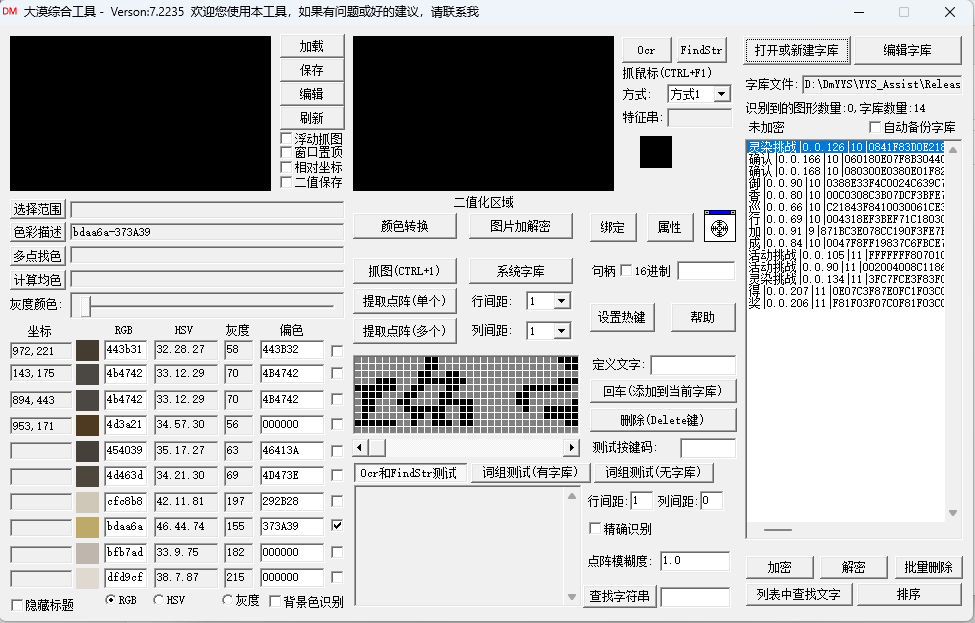
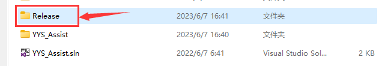
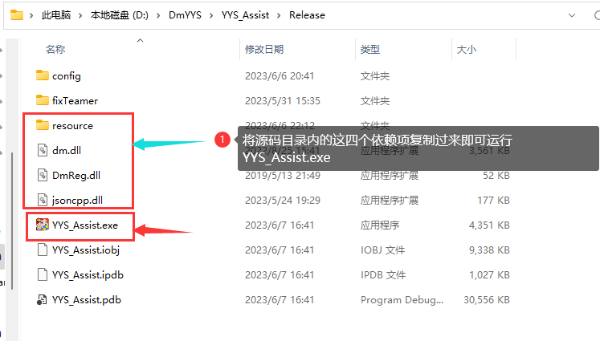
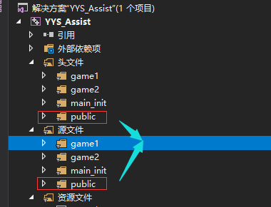
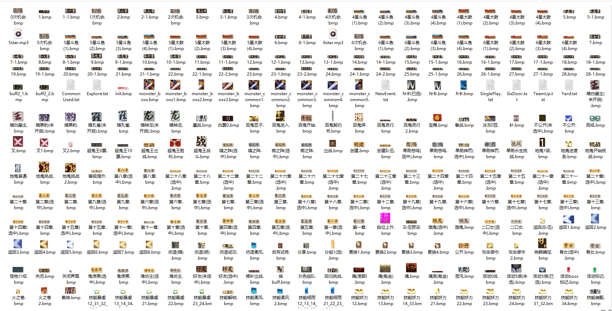
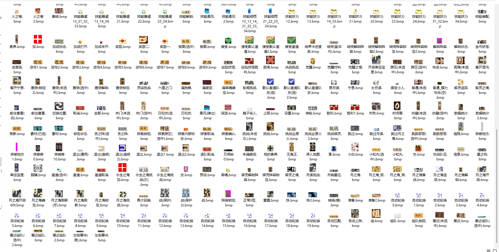

****
# YYS  ASSIST

[](https://github.com/RicardaY/yys/)   [](https://github.com/RicardaY/YYS-ASSIST.git)  [](https://isocpp.org/) 

 [](https://github.com/open-source-parsers/jsoncpp.git)    [](https://qm.qq.com/cgi-bin/qm/qr?k=hz_IP6wA1dEKXXyYM5LGW-k38u-39hWs&authKey=YvMt8TkLJ3XyQuFi6QyxOv5kdQwV702tJJVGLxlSYECLC+cE+cMap7e87B5qjdty&noverify=0&personal_qrcode_source=0)   [](https://github.com/RicardaY/YYS-ASSIST.git)    [](http://doc.sakurabot.com/) 

一个神奇的痒痒鼠图色识别助手，采用**Mersenne Twister**算法生成高质量的随机数，实现随机延迟点击、随机偏移坐标。

:orange_book:  简单、轻便、解放双手  
:hammer:  环境隔离、稳定防封、支持多开、效率翻倍  
:ram:  丰富的副本功能、优异的执行效率、清晰的教程文档、极致的用户体验！  
****

#### :rocket:前言

一款基于 **`C++17`**开发的阴阳师图色识别助手，同时注重执行效率，图形化采用`MFC`框架。配置文件使用`Json`格式存储，自动记忆方便下次使用。项目中运用大量随机数，增加随机性，稳定防封。

#### :unicorn: 使用文档：[点我查看](http://doc.sakurabot.com/)

#### 💦运行视频：[点我查看](http://www.sakurayys.cn/)
****
## :umbrella:简略教程(详细教程见[使用文档](http://doc.sakurabot.com/))

### :books:一、用打包好的exe,

> 在使用文档或交流群下载开箱即用。
>
> > 助手界面示例。
>
> <figure class = "half">
>     
>     
>     
> </figure>
>
> 
****
### 💦二、自己编译运行(需要有一定c++基础且看得懂大漠插件官方文档)

1.下载源码或者通过git拉取，使用VS2017及以上版本（最好是2017）打开项目，修改`YYS_AssistDlg.cpp`中的大漠插件注册码（有相应注释），找到代码`g_sn->Reg(_T(""),_T(""))`;在两个`_T("")`中填入自己的大漠注册码和附加码(可淘宝或度娘)。

**YYS_AssistDlg.cpp**

```c++
g_sn = new snow;
if (g_sn == NULL)
{
    return -500;
}
// 注册
long sn_ret = g_sn->Reg(_T(""), _T(""));  //此处分别填写注册码 附加码
if (sn_ret != 1)
{
    delete g_sn;
    return sn_ret;
}
```


2.使用大漠图色工具（度娘）自己截取游戏不同场景的图片(也不用全截，用到哪个功能就截取与之相对应的部分，以后慢慢完善。不想截图就用作者打包好的exe支持一下)放在项目的`resource`文件夹,（模拟器默认分辨率`[960*540 160dpi]`(照着这个分辨率只需截图，不用考虑识别区域坐标)。



3.将项目解决方案配置改为`debug`或`release` 解决方案平台选`x86`  （**注意：必须为x86,大漠64位需自己定制**）


4.`CTRL + F5`即可开始运行脚本,也可点击【生成--生成解决方案】，之后在`release`目录下会生成一个`exe`





### :robot:三、主要函数及接口介绍代码内注释非常详细，每个函数的功能都有说明。

> 其中主要识别类接口都在`yys_function.cpp`与`yys_function.h`中，`snow.cpp`与`snow.h`继承自大漠的类`dmsoft`，可以使用大漠插件的所有方法，并且在此基础上封装了一些常用的功能性方法，简化开发。

**项目文件组成：没有被框出的都是mfc界面组成文件，若没有特殊需要，不必做任何修改。主要逻辑代码只需要看public中的具体实现即可，每一个cpp文件对应一个副本功能**



> Tips:一般CGame_开头命名的文件都是mfc界面文件不用管，非CGame_开头的才是具体逻辑代码的实现文件。上图是筛选好的，逻辑代码全在public中。

### :fire:四、QQ交流群：462947796

### 五、自己截图说明

### :bulb:百度上可以搜到大漠综合工具，使用此工具抓图保存在项目resource目录下(需为bmp格式)，下面是所有的图，识字部分的字库代码中已提供(resource中的几个txt文件)，无需制作字库，只需截图。



**接上图**



> Tips:上两张图中的txt文件是用到的字库，源码的resource中已提供。
